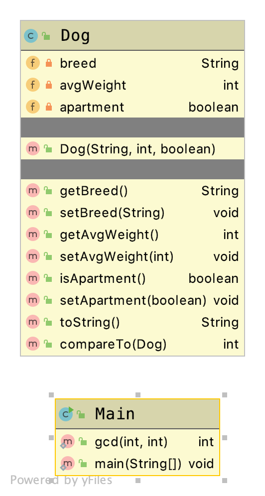

# Java Looping Branching and Collections

## Introduction

This project is used to introduce in Java

* Looping
* Branching and Conditionals
* Collections including Arrays, ArrayLists, HashMaps, HashSets

## Layout

The main class contains most of the work. The work in that class is meant to demonstrate certain commands, statements, and constructs to use when working with Collections. Most of the work is done using a class call Dog



## Results

The output of this application is

```TEXT
*** Arrays ***

*** Print out array ***
The pointer to the array [Lloopingandcollections.Dog;@d041cf

[Dogs{breed='Springer', avgWeight=50, apartment=false}, Dogs{breed='Bulldog', avgWeight=45, apartment=true}, Dogs{breed='Collie', avgWeight=45, apartment=false}, Dogs{breed='Chihuahua', avgWeight=5, apartment=true}, Dogs{breed='Corgie', avgWeight=35, apartment=true}]

*** For Loop ***

*** Dogs Not Good for Apartments ***
Dogs{breed='Springer', avgWeight=50, apartment=false}
Dogs{breed='Collie', avgWeight=45, apartment=false}
Breed 3 good for apartment? true

*** Let's Sort by Weight***
Dogs{breed='Chihuahua', avgWeight=5, apartment=true}
Dogs{breed='Corgie', avgWeight=35, apartment=true}
Dogs{breed='Bulldog', avgWeight=45, apartment=true}
Dogs{breed='Collie', avgWeight=45, apartment=false}
Dogs{breed='Springer', avgWeight=50, apartment=false}


*** ArrayList ***

*** Print ArrayList Using For Each ***
Dogs{breed='Chihuahua', avgWeight=5, apartment=true}
Dogs{breed='Corgie', avgWeight=35, apartment=true}
Dogs{breed='Bulldog', avgWeight=45, apartment=true}
Dogs{breed='Collie', avgWeight=45, apartment=false}
Dogs{breed='Springer', avgWeight=50, apartment=false}
Dogs{breed='Mutt', avgWeight=15, apartment=true}


Print ArrayList with Switch Statement
Chihuahua are 5 very small dogs
Corgie are 35 large dogs
Bulldog are 45 very large dogs
Collie are 45 very large dogs
Springer are 50 non-accounted for dogs
Mutt are 15 small dogs


*** Work with Elements ***
No match for Bulldog

Dogs{breed='Chihuahua', avgWeight=5, apartment=true}
Dogs{breed='Corgie', avgWeight=35, apartment=true}
Dogs{breed='Poodle', avgWeight=50, apartment=false}
Dogs{breed='Bulldog', avgWeight=45, apartment=true}
Dogs{breed='Collie', avgWeight=45, apartment=false}
Dogs{breed='Springer', avgWeight=50, apartment=false}
Dogs{breed='Mutt', avgWeight=15, apartment=true}


dogArrayList is (size) 7

Dog[3] Dogs{breed='Bulldog', avgWeight=45, apartment=true}
remove element at index 3
Dog[3] Dogs{breed='Collie', avgWeight=45, apartment=false}

*** Let's Sort by Weight From Largest to Smallest***
Dogs{breed='Poodle', avgWeight=50, apartment=false}
Dogs{breed='Springer', avgWeight=50, apartment=false}
Dogs{breed='Collie', avgWeight=45, apartment=false}
Dogs{breed='Corgie', avgWeight=35, apartment=true}
Dogs{breed='Mutt', avgWeight=15, apartment=true}
Dogs{breed='Chihuahua', avgWeight=5, apartment=true}


*** HashMap ***

*** Work with elements ***
element with key 3 Dogs{breed='Corgie', avgWeight=35, apartment=true}
Size of HashMap 6
Remove element with key 3
element with key 3 null
And now Size of HashMap 5

*** Print the HashMap ***

Key is 0   Value is Dogs{breed='Poodle', avgWeight=50, apartment=false}
Key is 1   Value is Dogs{breed='Springer', avgWeight=50, apartment=false}
Key is 2   Value is Dogs{breed='Collie', avgWeight=45, apartment=false}
Key is 4   Value is Dogs{breed='Mutt', avgWeight=15, apartment=true}
Key is 5   Value is Dogs{breed='Chihuahua', avgWeight=5, apartment=true}

*** Let's Sort ***
[5=Dogs{breed='Chihuahua', avgWeight=5, apartment=true}, 2=Dogs{breed='Collie', avgWeight=45, apartment=false}, 4=Dogs{breed='Mutt', avgWeight=15, apartment=true}, 0=Dogs{breed='Poodle', avgWeight=50, apartment=false}, 1=Dogs{breed='Springer', avgWeight=50, apartment=false}]

*** Printed another way ***
Key = 5 Value = Dogs{breed='Chihuahua', avgWeight=5, apartment=true}
Key = 2 Value = Dogs{breed='Collie', avgWeight=45, apartment=false}
Key = 4 Value = Dogs{breed='Mutt', avgWeight=15, apartment=true}
Key = 0 Value = Dogs{breed='Poodle', avgWeight=50, apartment=false}
Key = 1 Value = Dogs{breed='Springer', avgWeight=50, apartment=false}

*** Print the Original HashMap ***

Key is 0   Value is Dogs{breed='Poodle', avgWeight=50, apartment=false}
Key is 1   Value is Dogs{breed='Springer', avgWeight=50, apartment=false}
Key is 2   Value is Dogs{breed='Collie', avgWeight=45, apartment=false}
Key is 4   Value is Dogs{breed='Mutt', avgWeight=15, apartment=true}
Key is 5   Value is Dogs{breed='Chihuahua', avgWeight=5, apartment=true}


*** HashSets ***
Dogs{breed='Collie', avgWeight=45, apartment=false}
Dogs{breed='Corgie', avgWeight=35, apartment=true}
Dogs{breed='Springer', avgWeight=50, apartment=false}
Dogs{breed='Springer', avgWeight=50, apartment=false}
Dogs{breed='Chihuahua', avgWeight=5, apartment=true}
Dogs{breed='Poodle', avgWeight=50, apartment=false}
Dogs{breed='Mutt', avgWeight=15, apartment=true}

*** HashSet of Strings ***
The Current Size of the Set is 6
[Springer, Collie, Corgie, Mutt, Chihuahua, Poodle]
Does the Set contain Labrador? false
Does the Set contain Mutt? true
Remove Mutt

*** The set without mutt :-( ***
The Current Size of the Set is 5
[Springer, Collie, Corgie, Chihuahua, Poodle]


*** Recursion ***
GCD Running with p = 100 q = 255
GCD Running with p = 255 q = 100
GCD Running with p = 100 q = 55
GCD Running with p = 55 q = 45
GCD Running with p = 45 q = 10
GCD Running with p = 10 q = 5
GCD Running with p = 5 q = 0
GCD Returning 5
gcd(100, 255) = 5


*** Do While Loop ***
Picked: 9
Picked: 8
Picked: 5
Picked: 9
Picked: 7
```
